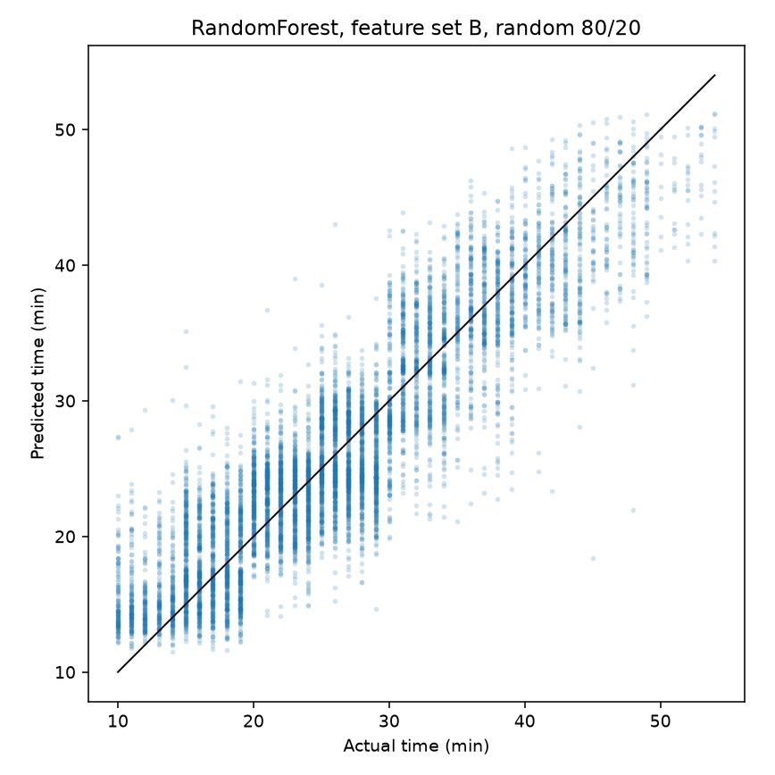

# Food delivery time prediction

Can the information known when an order is dispatched predict how many minutes the delivery will take?

## Results

| Model | Features | Split | MAE (min) | RMSE (min) | R2 |
|---|---|---|---:|---:|---:|
| Mean baseline | B | random 80/20 | 7.51 | 9.28 | -0.000 |
| LinearRegression | B | random 80/20 | 4.78 | 6.05 | 0.575 |
| DecisionTree | B | random 80/20 | 3.32 | 4.25 | 0.790 |
| ElasticNet | B | random 80/20 | 4.92 | 6.23 | 0.549 |
| RandomForest | B | random 80/20 | 3.19 | 4.05 | 0.810 |
| RandomForest | A | random 80/20 | 5.93 | 7.67 | 0.317 |
| RandomForest | B | grouped by restaurant code | 3.23 | 4.08 | 0.808 |
| RandomForest | B | time (last ~20% of dates) | 3.25 | 4.06 | 0.818 |



Run on 2026-09-26. Row counts, split sizes, the restaurant-code rule, the time-split cutoff and package versions are in [results/metrics.md](results/metrics.md). Test MAE by traffic level is in [results/mae_by_traffic.png](results/mae_by_traffic.png).

## Data

- Source: [Food Delivery Dataset](https://www.kaggle.com/datasets/gauravmalik26/food-delivery-dataset) on Kaggle, by Gaurav Malik.
- License / terms: Kaggle's license field says Other. The page does not state terms or origin. The file is not redistributed here.
- Size from this run: `train.csv`, 45593 rows x 20 columns. After dropping 3640 restaurant locations at (0, 0), 41953 orders remain. I also took the absolute value of 431 negative restaurant latitudes and 162 negative restaurant longitudes (sign typos; all 162 of the longitude cases also had a negative latitude).
- How to get it: sign in to Kaggle, open the dataset page above, click Download, and unzip. The archive has `train.csv`, `test.csv` and `Sample_Submission.csv`. Copy only `train.csv` (it has the target). `test.csv` has no target and is not used.
- Put the file at `data/train.csv`. Everything under `data/` except [data/README.md](data/README.md) is gitignored. That file has the column list.

## Approach

- Feature set B (main): restaurant and delivery latitude/longitude, haversine `distance_km`, weather, traffic, festival, City, courier age and rating, `Vehicle_condition`, `Type_of_order`, `Type_of_vehicle`, `multiple_deliveries`, and order hour from `Time_Orderd`.
- Feature set A (course set): coordinates, `distance_km`, weather, traffic and festival only.
- Left out of both: `Time_Order_picked`, the IDs, the restaurant code and `Order_Date`.
- Models on B, same random 80/20 split (seed 42): mean baseline; LinearRegression; DecisionTree (`min_samples_leaf=20`); ElasticNet (`alpha=0.1`, scaling on the numeric columns); RandomForest (300 trees, `random_state=42`). Categorical columns are listed in the column transformer. Missing values are imputed inside the pipelines, fitted on train only.
- Extra RandomForest rows: A on that same random split; B with `GroupShuffleSplit` on restaurant code (the leading `[A-Z]+RES` + digits token of `Delivery_person_ID`, e.g. `INDORES13` from `INDORES13DEL02`); B with a time split (last 9 of 44 dates, cutoff 2022-03-29).

## What I found

- On the random split, my RandomForest on B has MAE 3.19 minutes against 7.51 for the mean baseline (R2 0.810 vs -0.000).
- Feature set A did not get close for me. The same forest and the same test rows give MAE 5.93, so the extra dispatch fields are doing most of the work.
- Holding out restaurants (MAE 3.23) or the last 9 dates (3.25) barely moves my RandomForest error, so the 3.19 is not just memorizing a restaurant or the early weeks.
- ElasticNet did not beat ordinary least squares in my run (4.92 vs 4.78). The DecisionTree (3.32) is already close to the forest.

## Limitations

- Delivery points are synthetic. After dropping (0, 0) and taking absolute restaurant coordinates, every remaining row uses the same positive offset in latitude and longitude, from 0.009999 to 0.140000 degrees, and the haversine distance is at most 20.969 km. Ranking restaurants for an arbitrary address would be extrapolation, so I do not do that.
- Courier rating may already reflect how fast that person has delivered, so it is not a clean feature known only at dispatch.
- The dataset's origin and license are not stated.
- The course version also chained several restaurant pickups into one order; that is left out here because the model only learns restaurant-to-customer trips.

## How to run

Python 3.13. Put `train.csv` at `data/train.csv` first (see Data).

Windows (PowerShell):

```powershell
py -3.13 -m venv .venv
.venv\Scripts\python.exe -m pip install -r requirements.txt
.venv\Scripts\python.exe src/delivery_time_prediction.py data/train.csv --results-dir results
```

macOS / Linux:

```bash
python3.13 -m venv .venv
.venv/bin/python -m pip install -r requirements.txt
.venv/bin/python src/delivery_time_prediction.py data/train.csv --results-dir results
```

This prints the row count after each cleaning step and the metrics table, and writes `results/metrics.md`, `results/pred_vs_actual.png` and `results/mae_by_traffic.png`. RandomForest uses 300 trees unless you pass `--n-estimators`.

Tests (synthetic CSV in a temp directory; no download) and lint:

Windows (PowerShell):

```powershell
.venv\Scripts\python.exe -m pip install -r requirements-dev.txt
.venv\Scripts\python.exe -m ruff check .
.venv\Scripts\python.exe -m pytest -q
```

macOS / Linux:

```bash
.venv/bin/python -m pip install -r requirements-dev.txt
.venv/bin/python -m ruff check .
.venv/bin/python -m pytest -q
```

## Context

Built for the Foundations of Algorithm Design and Machine Learning course (PGDBA, IIT Kharagpur) in 2023; rewritten in 2026.
